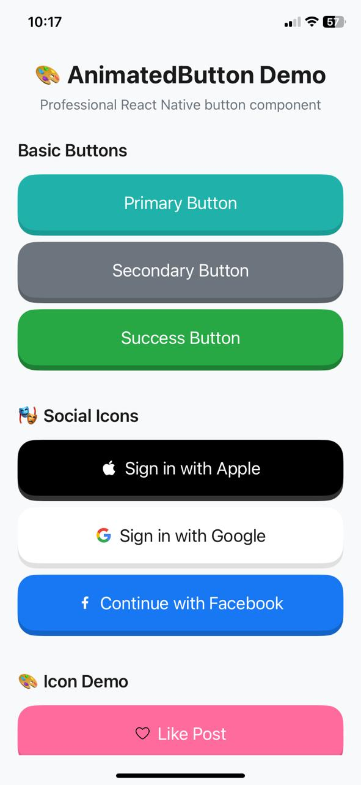
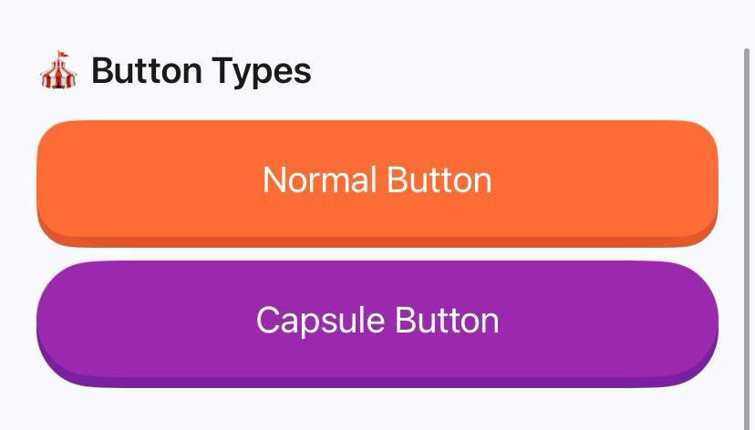
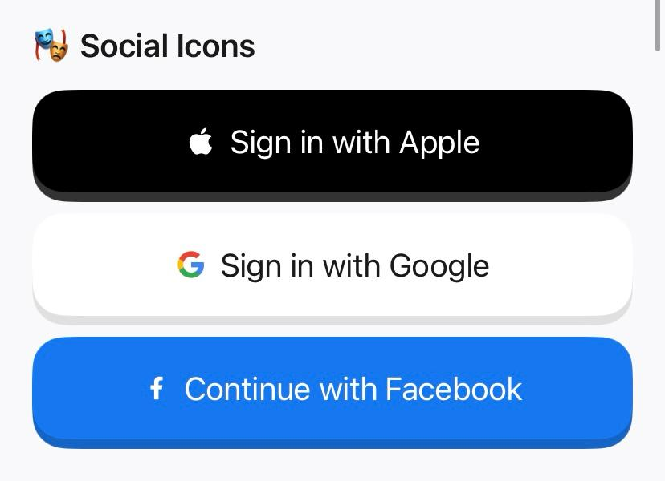

# React Native 3D Animated Buttons

A beautiful React Native animated button component with Duolingo-style 3D press animation and haptic feedback. Perfect for creating engaging, interactive buttons that feel great to press. Written in TypeScript with full type definitions.

## 📱 **Demo**

<!-- Add your demo video/GIF here -->
<div align="center">
  
### 🎬 **Live Demo Video**


### 📱 **Screenshots**


</div>

> **👆 Scan QR code with Expo Go to test on your device!**

## Features

- ✨ **Duolingo-style 3D press animation** - Smooth button press effect with shadow that feels like the popular language learning app
- 🎯 **Spring animations** - Natural, responsive press animations with configurable physics
- 📳 **Haptic feedback** - Tactile response on button press (Light/Medium/Heavy)
- 🎨 **Customizable design** - Colors, fonts, and styles
- 🔄 **Loading states** - Built-in loading indicator with optional text
- 🎯 **Icon support** - Built-in icons + comprehensive SVG icon library
- ↔️ **Icon positioning** - Left or right icon placement for better UX
- 🌍 **RTL language support** - Automatic right-to-left language detection
- 📱 **Responsive design** - Adapts to different screen sizes and orientations
- 🎪 **Button types** - Normal and capsule shapes
- ♿ **Enhanced accessibility** - Labels, hints, hitSlop, and proper states
- 🔒 **Press lock mechanism** - Prevents accidental double-presses
- 📘 **TypeScript** - Full type definitions included
- 🎨 **50+ SVG Icons** - Social, payment, arrows, actions, common UI icons

## Installation

Install the package along with its required dependencies:

```bash
npm install react-native-3D-animated-buttons react-native-svg expo-haptics
```

That's it! Everything you need in one command to create Duolingo-style interactive buttons.

## 🚀 Quick Start

```tsx
import { AnimatedButton } from 'react-native-3D-animated-buttons';

<AnimatedButton
  title="Continue"
  onPress={() => {}}
  icon="apple"
  type="capsule"
  backgroundColor="#20B2AA"
  shadowColor="#1A9B94"
/>
```

## Usage

### Basic Usage

```tsx
import React from 'react';
import { View } from 'react-native';
import { AnimatedButton } from 'react-native-3D-animated-buttons';

const App = () => {
  return (
    <View style={{ flex: 1, justifyContent: 'center', padding: 20 }}>
      <AnimatedButton
        title="Press Me"
        onPress={() => console.log('Button pressed!')}
      />
    </View>
  );
};

export default App;
```

### Advanced Usage

```tsx
import { AnimatedButton } from 'react-native-3D-animated-buttons';

<AnimatedButton
  title="Sign in with Apple"
  onPress={() => handleAppleSignIn()}
  backgroundColor="#000000"
  shadowColor="#333333"
  textColor="#FFFFFF"
  hapticStyle="Medium"
  icon="apple"
  type="capsule"
  loading={isLoading}
  loadingText="Signing in..."
  disabled={false}
  fullWidth={true}
  minHeight={60}
  testID="apple-signin-button"
  accessibilityLabel="Sign in with Apple account"
  accessibilityHint="Double tap to sign in with your Apple ID"
  onLongPress={() => showHelp()}
  hitSlop={{ top: 10, bottom: 10, left: 10, right: 10 }}
  style={{ marginBottom: 20 }}
  textStyle={{ fontSize: 16, fontWeight: 'bold' }}
/>
```

## Props

| Prop | Type | Default | Description |
|------|------|---------|-------------|
| `title` | string | **Required** | Button text |
| `onPress` | function | **Required** | Press handler function |
| `backgroundColor` | ColorValue | `'#20B2AA'` | Main button background color |
| `shadowColor` | ColorValue | `'#1A9B94'` | Shadow layer background color |
| `textColor` | ColorValue | `'#FFFFFF'` | Button text color |
| `style` | StyleProp<ViewStyle> | `{}` | Additional styles for button container |
| `textStyle` | StyleProp<TextStyle> | `{}` | Additional styles for button text |
| `disabled` | boolean | `false` | Whether button is disabled |
| `hapticStyle` | HapticStyle | `'Heavy'` | Haptic feedback style: `'Light'`, `'Medium'`, `'Heavy'` |
| `icon` | IconType | `null` | Built-in icon type: `'apple'`, `'google'`, `'phone'`, `'facebook'`, or `null` |
| `customIcon` | IconComponent | `null` | Custom SVG icon component (highest priority) |
| `customIconSvg` | string | `null` | Custom SVG icon as string markup |
| `iconSize` | number | `24` | Icon size (width and height in pixels) |
| `iconPosition` | IconPosition | `'left'` | Icon position: `'left'` or `'right'` (auto-swaps for RTL) |
| `loading` | boolean | `false` | Whether to show loading indicator |
| `loadingText` | string | `null` | Text to show when loading (optional) |
| `type` | ButtonType | `'normal'` | Button type: `'normal'` or `'capsule'` |
| `fullWidth` | boolean | `true` | Whether button should take full width |
| `minHeight` | number | `52` | Minimum height of the button |
| `testID` | string | `undefined` | Test identifier for testing frameworks |
| `accessibilityLabel` | string | `title` | Accessibility label for screen readers |
| `accessibilityHint` | string | `undefined` | Accessibility hint (auto-sets to 'In progress' when loading) |
| `onLongPress` | function | `undefined` | Long press handler function |
| `hitSlop` | Insets | `undefined` | Touch target expansion for better accessibility |
| `disableAnimations` | boolean | `false` | Disable animations for accessibility (reduced motion) |

## Examples

<div align="center">

</div>

### Different Button Types

```tsx
// Normal button
<AnimatedButton
  title="Normal Button"
  onPress={() => {}}
  type="normal"
/>

// Capsule button
<AnimatedButton
  title="Capsule Button"
  onPress={() => {}}
  type="capsule"
/>
```

### With Built-in Icons

<div align="center">

</div>

```tsx
// Apple Sign In
<AnimatedButton
  title="Sign in with Apple"
  onPress={() => {}}
  icon="apple"
  backgroundColor="#000000"
  shadowColor="#333333"
/>

// Google Sign In
<AnimatedButton
  title="Sign in with Google"
  onPress={() => {}}
  icon="google"
  backgroundColor="#FFFFFF"
  shadowColor="#E0E0E0"
  textColor="#1A1A1A"
/>

// Facebook Sign In
<AnimatedButton
  title="Continue with Facebook"
  onPress={() => {}}
  icon="facebook"
  backgroundColor="#1877F2"
  shadowColor="#1464C7"
/>

// Phone Sign In
<AnimatedButton
  title="Sign in with Phone"
  onPress={() => {}}
  icon="phone"
  backgroundColor="#34C759"
  shadowColor="#2AA946"
/>
```

### With Custom Icons

```tsx
// Method 1: Custom React Component (Recommended)
import MyCustomIcon from './icons/MyCustomIcon';

<AnimatedButton
  title="Custom Icon Button"
  onPress={() => {}}
  customIcon={MyCustomIcon}
  iconSize={24}
  backgroundColor="#FF6B9D"
  shadowColor="#E55A87"
/>

// Method 2: SVG String
<AnimatedButton
  title="SVG String Icon"
  onPress={() => {}}
  customIconSvg={`<svg width="24" height="24" viewBox="0 0 24 24" fill="none">
    <path d="M12 2l3.09 6.26L22 9.27l-5 4.87 1.18 6.88L12 17.77l-6.18 3.25L7 14.14 2 9.27l6.91-1.01L12 2z" fill="currentColor"/>
  </svg>`}
  iconSize={20}
  backgroundColor="#FFD700"
  shadowColor="#E6C200"
/>

// Method 3: Icon Priority (customIcon > customIconSvg > icon)
<AnimatedButton
  title="Priority Example"
  onPress={() => {}}
  icon="apple"           // Ignored (lowest priority)
  customIcon={HeartIcon} // Used (highest priority)
/>

// Method 4: Icon Positioning for Better UX
<AnimatedButton
  title="Previous"
  onPress={() => {}}
  customIconSvg={arrowLeftSvg}
  iconPosition="left"    // Arrow on left (default)
/>

<AnimatedButton
  title="Continue"
  onPress={() => {}}
  customIconSvg={arrowRightSvg}
  iconPosition="right"   // Arrow on right (better UX!)
/>
```

### Loading States

<div align="center">

</div>

```tsx
<AnimatedButton
  title="Submit"
  onPress={() => {}}
  loading={isSubmitting}
  loadingText="Submitting..."
  disabled={isSubmitting}
/>
```

### Custom Colors and Styles

```tsx
<AnimatedButton
  title="Custom Button"
  onPress={() => {}}
  backgroundColor="#FF6B6B"
  shadowColor="#E55555"
  textColor="#FFFFFF"
  style={{ 
    marginHorizontal: 20,
    marginBottom: 10 
  }}
  textStyle={{ 
    fontSize: 18,
    fontWeight: '600' 
  }}
/>
```

### Font Customization

```tsx
<AnimatedButton
  title="Custom Font Button"
  onPress={() => {}}
  backgroundColor="#FF6B35"
  shadowColor="#E55529"
  textStyle={{
    fontFamily: Platform.OS === 'ios' ? 'YourCustomFont-Bold' : 'your_custom_font_bold',
    fontSize: 18,
    fontWeight: '600',
    letterSpacing: 0.5,
  }}
/>

<AnimatedButton
  title="System Font"
  onPress={() => {}}
  textStyle={{
    fontFamily: Platform.OS === 'ios' ? 'System' : 'Roboto',
    fontSize: 16,
    fontWeight: '500',
  }}
/>
```

### Using the Icon Library

```tsx
// Import icons from the comprehensive library
import { AnimatedButton, icons } from 'react-native-3D-animated-buttons';

// Social media icons
<AnimatedButton
  title="Sign in with Apple"
  onPress={() => {}}
  customIconSvg={icons.appleV1}
  iconSize={20}
  backgroundColor="#000000"
/>

// Payment icons
<AnimatedButton
  title="Add to Cart"
  onPress={() => {}}
  customIconSvg={icons.cartV1}
  iconSize={18}
  backgroundColor="#FF6B35"
/>

// Arrow icons with positioning
<AnimatedButton
  title="Continue"
  onPress={() => {}}
  customIconSvg={icons.arrowRightV1}
  iconPosition="right"
  backgroundColor="#34C759"
/>

// Common UI icons
<AnimatedButton
  title="Like Post"
  onPress={() => {}}
  customIconSvg={icons.heartV1}
  iconSize={16}
  backgroundColor="#FF6B9D"
/>
```

## Advanced Features

### Spring Animations

The component uses spring-based animations for a natural, responsive feel that mimics the satisfying button press experience found in apps like Duolingo:

```tsx
// Custom spring configuration (built-in)
<AnimatedButton
  title="Spring Button"
  onPress={() => {}}
  // Uses: stiffness: 300, damping: 20, mass: 0.4
/>
```

### RTL Language Support

Automatically detects and adapts to right-to-left languages:

```tsx
// Icon automatically swaps to right side in RTL languages
<AnimatedButton
  title="Continue"
  icon="arrow-right"
  // iconPosition not specified - auto-detects RTL
/>
```

### Accessibility Features

Enhanced accessibility with proper labels, hints, and touch targets:

```tsx
<AnimatedButton
  title="Accessible Button"
  onPress={() => {}}
  accessibilityLabel="Primary action button"
  accessibilityHint="Double tap to perform the main action"
  hitSlop={{ top: 10, bottom: 10, left: 10, right: 10 }}
  testID="primary-button"
/>

// Reduced motion support for accessibility
<AnimatedButton
  title="Static Button"
  onPress={() => {}}
  disableAnimations={true} // No animations for users who prefer reduced motion
/>
```

### Press Lock Mechanism

Prevents accidental double-presses with configurable timing:

```tsx
<AnimatedButton
  title="Protected Button"
  onPress={() => handleExpensiveOperation()}
  // Automatically prevents rapid double-presses
/>
```

### Reduced Motion Support

Respects user accessibility preferences by allowing animation disabling:

```tsx
<AnimatedButton
  title="Accessible Button"
  onPress={() => {}}
  disableAnimations={true} // Respects user's reduced motion preference
/>
```

## Haptic Feedback

The component uses Expo Haptics for tactile feedback. You can customize the intensity:

- `'Light'` - Subtle feedback
- `'Medium'` - Moderate feedback  
- `'Heavy'` - Strong feedback (default)

```tsx
<AnimatedButton
  title="Light Haptic"
  onPress={() => {}}
  hapticStyle="Light"
/>
```

## TypeScript Support

This package is written in TypeScript and includes full type definitions. You'll get excellent IntelliSense support and type safety:

```tsx
import { AnimatedButton, AnimatedButtonProps, IconType, HapticStyle, ButtonType, IconPosition } from 'react-native-3D-animated-buttons';

// All props are fully typed
const MyButton: React.FC = () => {
  const handlePress = (): void => {
    console.log('Button pressed!');
  };

  return (
    <AnimatedButton
      title="Typed Button"
      onPress={handlePress}
      hapticStyle="Medium" // Autocomplete available: 'Light' | 'Medium' | 'Heavy'
      icon="apple" // Autocomplete available: 'apple' | 'google' | 'phone' | 'facebook'
      type="capsule" // Autocomplete available: 'normal' | 'capsule'
      iconPosition="right" // Autocomplete available: 'left' | 'right'
    />
  );
};
```

## Test App

This package includes a comprehensive test app demonstrating all features:

```bash
cd test-app
npm install
npx expo start
```

The test app showcases:
- ✅ **All button features** - Basic, social, icons, types, loading
- ✅ **Icon positioning** - Left/right placement examples
- ✅ **Font customization** - Typography styling options
- ✅ **Side-by-side layouts** - Responsive button pairing
- ✅ **Professional architecture** - Clean, modular code structure

Perfect for understanding how to integrate the component in your project!

## Responsive Design

The component automatically adapts to different screen sizes and orientations using a responsive scaling system based on device dimensions. It responds to orientation changes in real-time for optimal user experience, ensuring your Duolingo-style buttons look great on any device.

## Performance Features

- **React.memo** - Prevents unnecessary re-renders
- **useCallback** - Stable event handler references
- **useMemo** - Optimized computed values
- **useWindowDimensions** - Efficient orientation change handling
- **Press lock** - Prevents rapid double-presses
- **Duolingo-inspired UX** - Smooth, satisfying button interactions that users love

## License

MIT

## Contributing

Pull requests are welcome! Please make sure to update tests as appropriate.

## Support

If you like this component, please give it a ⭐ on GitHub!
